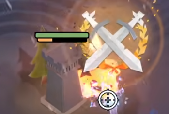
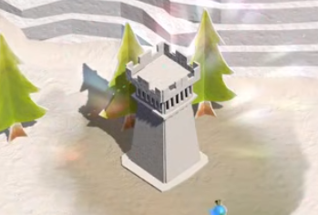

# Visual Inspiration

Reference images and the specific thing we want to steal from each. Images live
in `inspo/`.

## Tower HP and Cooldown Bars

**Tags:** `Game Feel / Juice`, `Immersion`

Floating bars attached to a tower, drawn under it rather than over the world.

- Bar sits at the base/bottom of the tower, not floating high above it.
- Rounded pill shape, dark outline, thick enough to read at a glance.
- HP bar: green when healthy, shifts to orange/red as it drops.
- Cooldown bar: fills as the build/upgrade/reload progresses.
- Both bars can stack; only the relevant ones are shown.

**Key behavior:** bars auto-hide.

- HP bar is hidden at full HP, appears on damage.
- Cooldown bar is hidden when the cooldown is done, appears while charging.
- A healthy, idle tower is completely clean — no UI chrome at all (second image).

**Why:** the world stays uncluttered by default, and any visible bar instantly
means "something needs attention here."

**Open questions:**

- Do bars fade out after a delay at full HP, or snap off immediately?
- Same treatment for the main base, buildings under construction, and enemies?
- Do bars scale/billboard with camera zoom?

## Ground Selectors and Radius Rings

**Tags:** `Readability`, `Game Feel / Juice`, `Immersion`

Reference is verbal only — a pale, broken ring painted flat on the grass of a
low-poly village, reading as a mark on the ground rather than a decal stuck to
the camera. Nothing is copied; we take the idea, not the art.

- Marks lie on the ground plane and take the world's perspective, so they belong
  to the scene instead of floating over it.
- Broken, not solid: gaps keep the shape light and let the terrain read through.
- Unlit and pale, so it holds the same value at night as at noon.

**The grammar we settled on:** two shapes, two meanings, never mixed.

- **Corners mean "this is the thing".** Four L brackets, one per corner of a
  rect, framing a target or a footprint without boxing it in.
- **Arcs mean "this is the reach".** A broken circle, and only ever at the
  radius the simulation actually uses.

**One bracket, not many.** The cursor always carries a bracket — over empty
ground it just rides the lattice cell under the pointer, cool-toned and dim. It
never blinks out and back; it *retargets*, gliding and resizing from whatever it
was framing to whatever it frames next. A mark that is always there costs
nothing to learn, and the eye tracks one moving object far better than it tracks
several appearing and disappearing ones.

**Three marks:**

- **One-cell action selector.** What a left click is about to hit. Corners at
  one cell, in the "ok" tone. Snapped to the cell for nodes (they sit on cell
  centers) and centred on the body for enemies, who walk continuously and would
  otherwise make the bracket hop a whole cell at a time.
- **Footprint selector.** Placement, relocation, and hovering a finished
  building. Corners at the building's complete footprint, so a 3x3 tower is
  framed whole rather than pinched to its anchor cell. Coloured by the placement
  verdict during a build, and in the hint tone for a plain hover, so the two
  never get confused.
- **Twelve-segment radius ring.** Three arcs per quadrant, hairline gaps between
  the three and a wider break centred on each cardinal axis, so the four groups
  read as separate. Aggro's taunt gets a second ring in its own colour — a
  different radius with a different meaning.

**Key behavior:** the ring is a claim about the simulation, so it never lies.

- Corners breathe; the ring does not. Corners pulse their offsets, while the
  ring holds its true radius and lets its opacity do the breathing. A scaled
  ring would advertise coverage the tower does not have.
- No gameplay radius, no ring. House, obelisk, and spikes get corners and
  nothing else — an arc is only ever drawn for reach the sim really computes.
- One clock for everything, so two marks alive at once stay in phase and
  switching targets mid-breath carries the phase over instead of snapping.
- The corners glide, the rings do not. Corners are a pointer and may ease into
  place; a ring is a claim about where the simulation reaches, and a claim that
  slides toward its position is a claim that is briefly wrong.
- Weight says how committed the mark is. The placement/relocation verdict — the
  one mark the player is about to act on — sits a shade firmer than the
  informational action and hover corners. It is a ratio off a single shared
  value, so the hierarchy survives any tuning pass instead of inverting.
- Marks are drawn per frame from live state and claim a pool slot, so anything
  destroyed, picked up, or upgraded simply stops being drawn.

**Why:** the player should be able to tell "what am I about to touch" from "how
far does this reach" without reading a single word, and should be able to trust
the second one enough to place a tower by it.

**Open questions:**

- Should the ring thicken or brighten when a tower is actually firing?
- Do overlapping coverage rings need a combined/union treatment, or is a pile of
  rings honest enough?
- Does the action selector want a distinct shape per tool, or does the badge
  already carry that?
